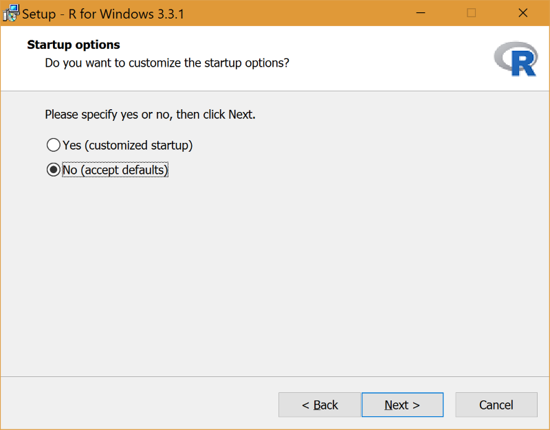
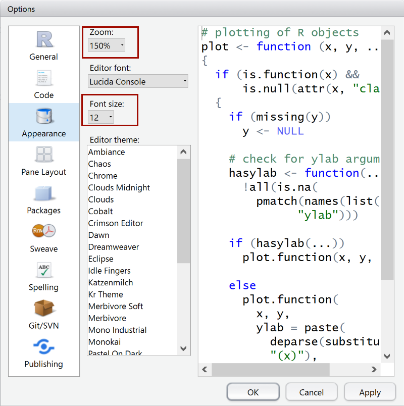

#1. Installing R and RStudio

[R](https://www.r-project.org/) is a programming language and a software environment, designed for statistics first and foremost. [RStudio](https://www.rstudio.com/) is an IDE commonly used with R which adds tooling and features such as basic debugging and visual inspection of variables.

##Installing R

1. Download the (lastest version of R)[https://cran.r-project.org/mirrors.html] (use the _base_ binaries).
2. Run the installer and select the default folder.
3. On the __Select Component__ page select _User Installation_. On a 64-bit machine this will include both 32-bit and 64-bit files.

4. On the __Startup options__ page select the default _No_ option.

5. Use the default options for the remainder of the screens.

Congratuations, you are now a statistician!

##Installing RStudio

1. Download the (lastet version of RStudio Desktop)[https://www.rstudio.com/products/rstudio/download3/]
2. Choose all the default options

Easy

## Optimizing RStudio

Depending on your screen resolution and DPI, RStudio may appear small and hard to read. To improve this follow these steps:

1. Open __RStudio__ (type RStudio in start menu).
1. Go to __Tools > Global Options > Appearance__.
2. Use the __Zoom__ and __Font size__ settings to improve the appearance. On a 4K display at 250% DPI, I found 150% zoom and a font size of 12 works well for me.

## End of Part 1

You now have R and RStudio, and ready to get started. Proceed to [Part 2](Part2-Installing-Packages.md)