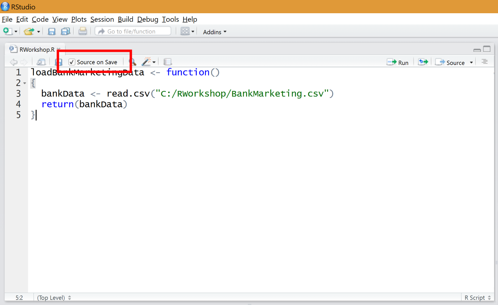

#3. Loading Data

##Bank Marketing Data Set

For this workshop we will be using a bank marketing data set taken from the [UCI Machine Learning Repository] (https://archive.ics.uci.edu/ml/index.html). This dataset contains about 4500 records of marketing campaign calls to the clients of a Portuguese bank. Each record contains a number of input variables like __age__, __occupation__, and the __month__ when a client was last called, and a simple __yes/no__ output variable indicating whether or not that client subscribed to the product on offer. For a more detailed explanation of the data set and its parameters, click [here](https://archive.ics.uci.edu/ml/datasets/Bank+Marketing).

__Ultimately what we want to predict whether or not a client is likely to respond to a similar marketing campaign in the future.__

##Loading the CSV

1. Download and copy [BankMarketing.csv](Data/BankMarketing.csv) to a location of your choice
2. In __RStudio__ create a new R script with __File > New File > R Script__. Save and call it `RWokshop.R`.
3. Let's create a new function called `loadBankMarketingData()`:

  ```R
  loadBankMarketingData <- function()
  {
  }
  ```
  
4. R makes it very simple to load a CSV (and other common data file types). On the first line of your function call `read.csv()`:

  ```R
  bankData <- read.csv("C:/RWorkshop/BankMarketing.csv")
  ```
  
  Note that no semicolons are used in R. 
  
5. We can now return the result:

  ```R
  return(bankData)
  ```
  
##Viewing the Data

Now that we have written and saved the script, we can call it from an R session or in our case, the RStudio console.

1. Try calling the function from the console:

  ```R
  loadBankMarketingData()
  ```
  
  What happens?
  
2. In order to access the function we first need to make it available in the current session. In the console enter:

  ```R
  source("C:/RWorkshop/RWorkshop.R")
  ```
  
3. __RStudio__ gives you a nice shortcut for doing this. Simply check the __Source on Save__ option at the top of the script. Now saving the file will automatically execute the `source()` function in the console.



4. Now call the function again

  ```R
  loadBankMarketingData()
  ```
  
  The output of our function is a _data frame_; an important data structure in R. A data frame is a table of data which can have different column types. By default R will call the `print()` on the output of our function and to try to write out something useful. In this case you will see some of the CSV data followed by something like this:
  
  ```
  [ reached getOption("max.print") -- omitted 3933 rows ]
  ```
  
5. Again in the console call the function, but this time assign the result to a global variable.

  ```R
  data <- loadBankMarketingData()
  ```
  
  You will notice the variable appearing in the __Global Environment__ window. This means the variable is now available to be viewed and used in subsequent work that you do in the console window.
  
  
  
6. Double click the variable to view its content or alternatively call `View(data)` from the console:


##End of Part 3

We now have our data set loaded and stored in a data frame. Let's move on to [Part 4 - Pre-processing the data](Part4-Pre-Processing.md)
