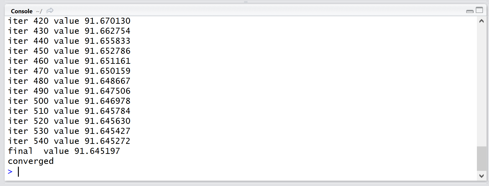
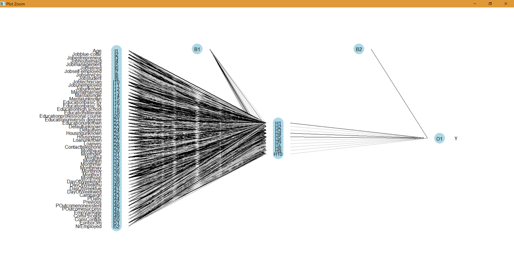

#5. Training a neural network

##Creating a Test Set

When training a model of any kind (neural networks included) it's often a good idea to use a portion of our data for testing. This means we break up the data set into a training set, and a test set. The test set allows us to see how well our model is doing against data it has never observed before, and gives us a way to compare and contrast different models.

1. Create a new function in `RWorkshop.R` called `trainBankModel()`.

2. First let's load our data using the function we previously wrote:

  ```R
  bankData <- loadBankMarketingData()
  ```
 
3. Next, fix R's random number generator seed. The purpose of this is so that across multiple runs our random selection of test cases (as well as any other initialization code in the neural network) is consistent, making them comparable.

  ```R
  set.seed(1)
  ```
  
4. Let's use 900 rows (about 20% of the data) for testing purposes. Taking a random selection of rows from a data frame is made simple with the `sample()` function:

  ```R
  testIndices <- sample(nrow(bankData), 900)
  testSet <- bankData[testIndices,]
  trainingSet <- bankData[-testIndices,]
  ```
  
  
##Training the Neural Network

We previously installed and attached the `nnet` package which we will use to train our neural network.

1. In the same function, after splitting the data, call `nnet()`:

  ```R
  bankModel <- nnet(Y~., trainingSet, size=10, MaxNWts=5000, maxit=2000)
  ```
  
  The `nnet()` function accepts many parameters. The parameters stated above are:
  * __Formula (Y~.):__ In R a formula expression is a first class citizen. Here we are saying `y` is a function of all other variables (denoted with a period) in our data frame. Note that `Y` is the name of our output column.
  
  * __trainingSet:__ Our training data.
  
  * __Size (optional):__ The number of neurons in the hidden layer
  
  * __MaxNWts (optional):__ This is a limit on how many connections can exist in our model. If we have too many neurons in the model an error will be returned.
  
  * __maxit (optional):__ The number of times the algorithm will iterate over our data. Often the algorithm will reach convergence earlier than this, at which point it will stop.
  
  There are many other parameters that can be set for training. For a full listing, see the [nnet documentation] (https://cran.r-project.org/web/packages/nnet/nnet.pdf)

2. Return the model:

  ```R
  return(bankModel)
  ```

3. Before we test our neural network, let's run the training and see what happens. Execute your new function from the console:

  ```R
  trainBankModel()
  ```
  
  You should see an output that looks something like this:
  
  
  
  This tells us that the training took 540 iterations to arrive at the best solution it could, and some measure of the error rate. You can see that the longer we train the model with our training data, the lower the error gets. However early on the rate of change is larger, and gets smaller as we approach an optimal solution.


##Visualizing the Neural Net

Unlike some other machine learning methods like decision trees, a neural network is often treated as a __black box__. However to get a feel for how it is constructed, let's visualize it.

1. Download the [nnet plot extension](RScripts/nnet_plot_update.R).

2. Open the script in RStudio.

3. Check the __Source on Save__ checkbox and save the file.

4. In the console window run the training and store the result in a global variable:

  ```R
  bankModel <- trainBankModel()
  ```
  
5. Now use the `plot()` function to visualize the neural network:
6. 
  ```
  plot(bankModel)
  ```
  
  What do you see? Can you explain what all the input variables are? (If the plot window is too cluttered, click the __zoom__ button to expand it out to a new window. Reducing the global zoom in __Tools > Global Options > Appearance__ can also help with the clutter.)

> __Explanation:__ You will notice that as described in [Part 4](Part4.md), the categorical variables are expanded out into multiple inputs with each input being one of the possible options. Also look at the connections going from the inputs to the hidden layer, and from the hidden layer to the output. Darker lines represent a larger value. Keep in mind that just by looking at these weights it's not possible to easily determine one variable being more important than another. Often there are complex, non-linear relationships between these variables that are important, which is why we use a machine learning technique in the first place.



# Making Predictions and Testing the Model

We now have a model trained. Let's see how well it performs over our test data. We're going to measure 3 metrics:
* Percentage of overall correct predictions.
* Percentage of correct _yes_ predictions.
* Percentage of correct _no_ predictions.

1. Create a new function in `RWorkshop.R` called `testBankModel()`:
  ```R
  testBankModel <- function(testData)
  {
  }
  ```

2. In this function, use `predict()` to calculate the predictions for each row. We need to exclude the output column, since that's what the neural network will be predicting:
  ```R
  outputCol <- length(testSet)
  testPredictions <- predict(bankModel, testSet[,-outputCol], type="class")
  ```
  
  The `type` argument tells the `predict()` function to return the string value (yes or no) instead of a numerical value (a probability between 0 and 1)

3. To get the percentages let's first get the totals from our test set:
  ```R
  total <- nrow(testSet)
  yesTotal <- length(which(testSet[, outputCol] == "yes"))
  noTotal <- total - yesTotal
  ```
  
4. Now let's count how many of our predictions matched what was in output column of the test set:
  ```R
  matches <- testPredictions[which(testPredictions == testSet[, outputCol])]
  ```
  
  This will produce a subset of our predictions that matched what was in the test set.

5. Count the correct predictions:
  ```R
  correctTotal <- length(matches)
  correctYes <- length(which(matches == c("yes")))
  correctNo <- correctTotal - correctYes
  ```
  
6. And print the percentages:
  ```R
  print(paste("Correct - Total:", correctTotal*100/total))
  print(paste("Correct - Yes:", correctYes*100/yesTotal))
  print(paste("Correct - No:", correctNo*100/noTotal))
  ```
  
7. Call the new `testBankModel()` function from `trainBankModel()` just before returning the model.

8. Now call `trainBankModel()` from the console. You should see results that look something like this:

  ```R
  final  value 323.401752 
  converged
  [1] "Correct - Total: 88.2222222222222"
  [1] "Correct - Yes: 34.1463414634146"
  [1] "Correct - No: 93.6430317848411"
  ```

##Additional Experiments and Questions:

* What do you notice about the correct _yes_ and _no_ predictions?
* Why do you think the _yes_ predictions do poorly compared to _no_ predictions?
* Try changing the `Size` parameter (number of neurons in the hidden layer) to different values like 15, 20 and 30, and run the training again. What do you notice?
* Try changing the `Size` parameter to 1. What happens? Try changing the `set.seed()` value. What do you notice?
* Try setting the `maxit` parameter to 1 before training. What do you notice? Why?

##End of Part 5
We have successfully trained a neural network with our data, and used it to make predictions. Please move on to [Part 6 - Integrating R in an MVC web application](Part6-DotNet-Integration.md)
