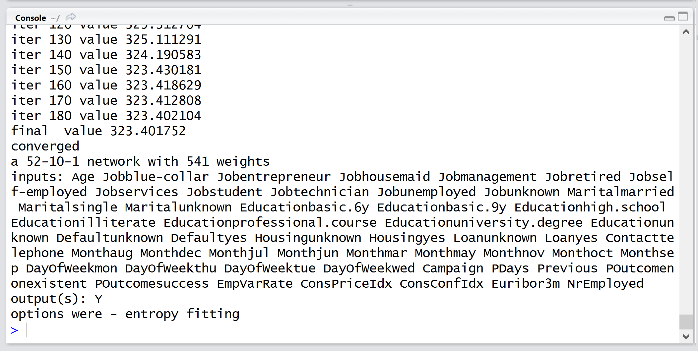

#5. Training a neural network

##Creating a Test Set

When training a model of any kind (neural networks included) it's often a good idea to use a portion of our data for testing. This means we break up the data set into a training set, and a test set. The test set allows us to see how well our model is doing against data it has never observed before, and gives us a way to compare and contrast different models.

1. Create a new function in `RWorkshop.R` called `trainBankModel()`

2. First let's load our data using the function we previously wrote:

  ```R
  bankData <- loadBankMarketingData()
  ```
 
3. Next, let's fix the R's random number generator seed. The purpose of this is so that across multiple runs our random selection of test cases (as well as any other initialization code in the neural network) is consistent, making them comparable.

  ```R
  set.seed(1)
  ```
  
4. Let's use 900 rows (about 20% of the data) for testing purposes. Taking a random selection of rows from a data frame is very simple:

  ```R
  testIndices <- sample(nrow(bankData), 900)
  testSet <- bankData[testIndices,]
  trainingSet <- bankData[-testIndices,]
  ```
  
  
##Training the Neural Network

We previously installed and attached the `nnet` package which we will use to train our neural network.

1. In the same function, after splitting the data into test and training sets, call `nnet()`

  ```R
  bankModel <- nnet(y~., trainingSet, size=15, MaxNWts=5000, maxit=10000)
  ```
  
  The `nnet()` function accepts many parameters. The parameters stated above are:
  * __Formula (y~.):__ In R a forumla expression is a first class citizen. Here we are saying `y` is a function all other variables (denoted with a period) in our data frame. Note that y is the nam eof our output column.
  
  * __trainingSet:__ Our training data.
  
  * __Size (optional):__ This is the number of neurons in the hidden layer
  
  * __MaxNWts (optional):__ This is a limit on how many connections can exist in our model. If we have too many neurons in the model an error will be returned.
  
  * __maxit (optional):__ The number of times the algorithm will iterate over our data. Often the algorithm will reach convergance earlier than this, at which point it will stop.
  
  There are many other parameters that can be set for training. For a full listing, see the [nnet documentation] (https://cran.r-project.org/web/packages/nnet/nnet.pdf)

2. Return the model:
  ```R
  return(bankModel)
  ```

3. Before we test our neural network, let's run the training and see what happens. Execute your new function from the command line:
  ```R
  trainBankModel()
  ```
  
  You should see an output that looks something like this:
  
  
  
  This tells us that the training took 540 iterations to arrive at a the best solution it could, and some measure of the error achieved. You can see that the longer we train the model with our training data, the lower the error gets. However early on the rate of change is much larger, and gets smaller as we approach an optimal solution.


##Visualizing the Neural Net

Unlike some other machine learning methods like decision trees, a neural network is treated as a __black box__, however to get a feel for how it is constructed, let's visualize it.

1. Download the  nnet plot extension R script.

2. Open the script in RStudio.

3. Check the __Source on Save__ checkbox and save the file.

4. In the `trainBankModel()` function, after training the model, use the `plot()` method with your model:

  ```
  plot(bankModel)
  ```
5. Now execute the training function from the console again. What do you see? Can you explain what all the input variables are?

> __Explanation:__ You will notice that as described in [Part4](Part4.md), the categorical variables are expanded out into multiple inputs with each input being one of the possible options. Also look at the connections going from the inputs to the hidden layer, and from the hidden layer to the output. Darker lines represent a larger value. Keep in mind that just by looking at these weights it's not possible to easily determine one variable being more important than another. Often there are complex, non-linear relationships between these variables that are important, wich is why we use a machine learning technique in the first place.


